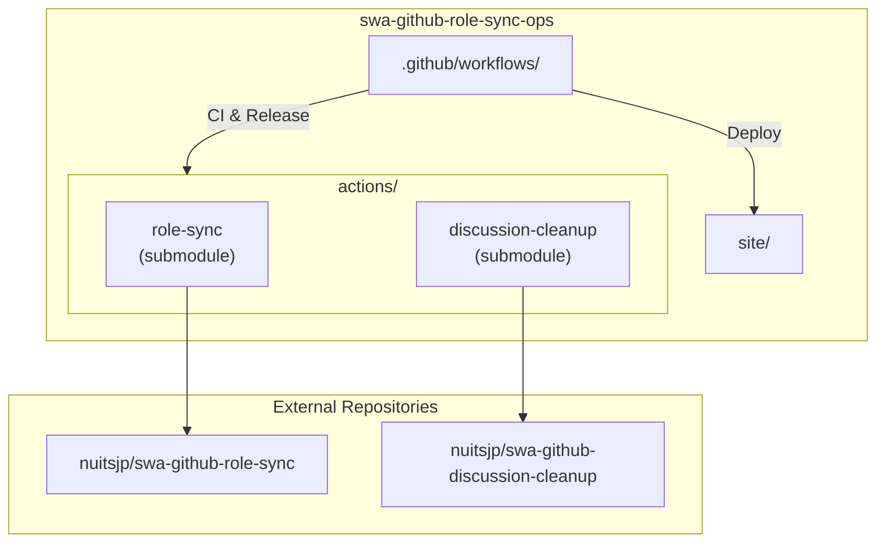

# swa-github-role-sync-ops

[](https://github.com/nuitsjp/swa-github-role-sync-ops/actions/workflows/npm-ci.yml)
[](https://github.com/nuitsjp/swa-github-role-sync-ops/actions/workflows/deploy-site.yml)
[](https://github.com/nuitsjp/swa-github-role-sync-ops/actions/workflows/role-sync-released.yml)

Azure Static Web Apps (SWA) と GitHub リポジトリ権限の同期を実現する GitHub Actions の運用ワークフローと、2 つの Action をまとめたモノレポです。

## 概要

このリポジトリは以下のコンポーネントで構成されています：

| コンポーネント | 説明 |
|---------------|------|
| [swa-github-role-sync](https://github.com/nuitsjp/swa-github-role-sync) | GitHub リポジトリの `admin`/`write` 権限を SWA カスタムロールへ同期し、招待リンクを Discussion で通知する Action |
| [swa-github-discussion-cleanup](https://github.com/nuitsjp/swa-github-discussion-cleanup) | 有効期限切れの招待 Discussion を自動削除する Action |
| `.github/workflows/` | CI・リリース・定期同期などの運用ワークフロー |
| `site/` | 動作確認用のサンプル SWA サイト |

### アーキテクチャ



## 主な機能

### swa-github-role-sync

- GitHub `admin` → SWA カスタムロール（デフォルト: `github-admin`）
- GitHub `write`/`maintain` → SWA カスタムロール（デフォルト: `github-writer`）
- 差分検出による重複招待の抑制
- ユーザーごとの招待 Discussion を自動作成
- `GITHUB_STEP_SUMMARY` への同期結果サマリー出力

### swa-github-discussion-cleanup

- 作成日時ベースの期限切れ Discussion 自動削除
- タイトルテンプレートによる削除対象のフィルタリング
- 手動実行時の即時削除モード

## クイックスタート

### 1. リポジトリの準備

```powershell
# リポジトリをクローン
git clone https://github.com/nuitsjp/swa-github-role-sync-ops.git
cd swa-github-role-sync-ops

# サブモジュールを初期化
git submodule update --init --recursive
```

### 2. Secrets の設定

以下の Secrets をリポジトリまたは Organization に登録してください：

| Secret | 説明 |
|--------|------|
| `AZURE_CLIENT_ID` | Azure OIDC 認証用のクライアント ID |
| `AZURE_TENANT_ID` | Azure テナント ID |
| `AZURE_SUBSCRIPTION_ID` | Azure サブスクリプション ID |
| `AZURE_STATIC_WEB_APPS_API_TOKEN` | SWA デプロイ用トークン |
| `ROLE_SYNC_APP_ID` | GitHub App の ID |
| `ROLE_SYNC_APP_PRIVATE_KEY` | GitHub App の秘密鍵 |
| `ACTIONS_RELEASE_TOKEN` | リリース用 PAT（両サブモジュールの `contents:write` が必要） |

### 3. ワークフローの実行

```powershell
# ロール同期を手動実行
gh workflow run role-sync-released.yml

# 実行結果を確認
gh run watch --exit-status
```

## リポジトリ構成

```
swa-github-role-sync-ops/
├── .github/
│   └── workflows/           # CI・リリース・運用ワークフロー
│       ├── npm-ci.yml           # 両 Action の CI（format, lint, test, dist 検証）
│       ├── deploy-site.yml      # サンプルサイトのデプロイ
│       ├── role-sync-released.yml   # リリース版 Action によるロール同期
│       ├── release-role-sync.yml    # Role Sync Action のリリース
│       └── release-discussion-cleanup.yml  # Cleanup Action のリリース
├── actions/
│   ├── role-sync/           # swa-github-role-sync (サブモジュール)
│   └── discussion-cleanup/  # swa-github-discussion-cleanup (サブモジュール)
├── docs/
│   ├── design.md            # 設計メモ
│   ├── user-guide.md        # ユーザーガイド
│   └── developer-guide.md   # 開発者ガイド
├── site/                    # サンプル SWA サイト
│   ├── index.html
│   └── staticwebapp.config.json
└── package.json             # npm workspaces 設定
```

## ワークフロー一覧

| ワークフロー | 説明 | トリガー |
|-------------|------|---------|
| `npm-ci.yml` | 両 Action の CI（format/lint/test/dist 検証） | PR, push, 手動 |
| `deploy-site.yml` | サンプルサイトを SWA へデプロイ | push (`site/`), 手動 |
| `role-sync-released.yml` | リリース版 Action でロール同期実行 | 毎週月曜 3:00 UTC, 手動 |
| `role-sync-local.yml` | ローカルビルド版でロール同期（開発用） | 手動 |
| `delete-discussions.yml` | 招待 Discussion の削除 | 手動 |
| `release-role-sync.yml` | Role Sync Action のタグ作成・リリース | 手動 |
| `release-discussion-cleanup.yml` | Cleanup Action のタグ作成・リリース | 手動 |
| `security-scans.yml` | セキュリティスキャン | スケジュール |

## 開発

### ローカルでの検証

```powershell
# 依存関係のインストール
npm ci --workspaces

# 全 Action の検証（format + lint + test + dist チェック）
npm run verify

# Role Sync Action のみ検証
npm run verify:role-sync

# Discussion Cleanup のみビルド
npm run verify:discussion-cleanup
```

### Action の個別開発

```powershell
# Role Sync Action
cd actions/role-sync
npm ci
npm run verify    # format + lint + test + dist チェック
npm run package   # dist 更新

# Discussion Cleanup Action
cd actions/discussion-cleanup
npm ci
npm run package   # rollup build
```

### テスト駆動開発

このリポジトリでは t-wada スタイルの TDD（RED-GREEN-REFACTOR）を採用しています：

1. 失敗するテストを書く（RED）
2. テストを通す最小限のコードを書く（GREEN）
3. コードをリファクタリングする（REFACTOR）

```powershell
cd actions/role-sync
npm test         # テスト実行
npm run coverage # カバレッジ計測
```

## ドキュメント

| ドキュメント | 内容 |
|-------------|------|
| [docs/user-guide.md](docs/user-guide.md) | セットアップ手順、ワークフロー例、トラブルシューティング |
| [docs/developer-guide.md](docs/developer-guide.md) | 開発環境構築、テスト、リリース手順 |
| [docs/design.md](docs/design.md) | アーキテクチャ、シーケンス図、設計方針 |

各 Action のサブモジュールにも詳細なドキュメントがあります：

- [actions/role-sync/README.ja.md](actions/role-sync/README.ja.md) - 入出力パラメーター、使用例
- [actions/discussion-cleanup/README.ja.md](actions/discussion-cleanup/README.ja.md) - クリーンアップ設定

## ライセンス

MIT License - 詳細は各サブモジュールの `LICENSE` ファイルを参照してください。

## コントリビュート

1. フォークしてブランチを作成
2. TDD でテストとコードを追加
3. `npm run verify` が通ることを確認
4. `dist/` を再生成（`npm run package`）してコミット
5. Pull Request を作成

詳細は [docs/developer-guide.md](docs/developer-guide.md) を参照してください。
