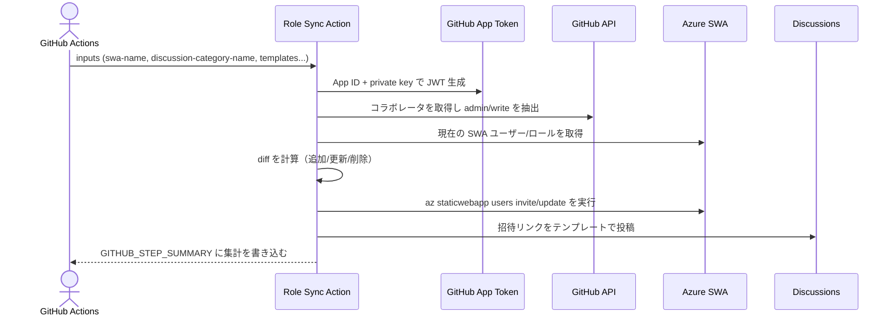
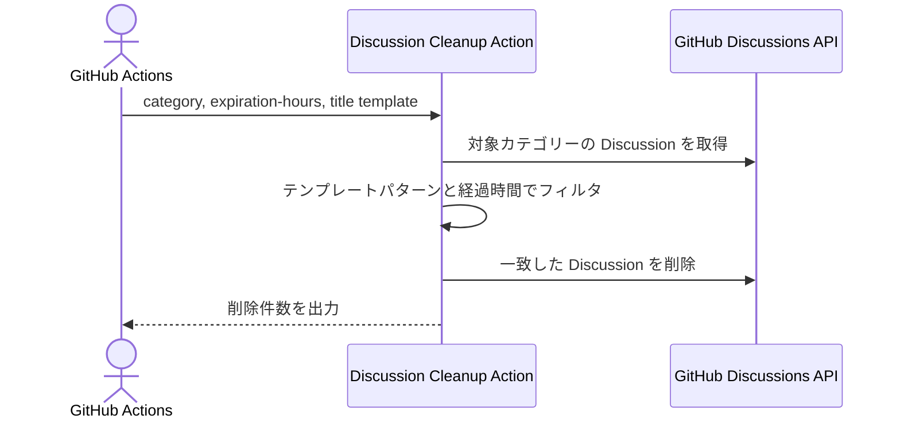

# 設計メモ

2 つの Action のフローと依存関係をまとめた設計ノートです。実装詳細よりも「どのイベントで何を呼ぶか」を把握するための資料として利用してください。

## 全体構成

- `swa-github-role-sync`：GitHub の権限をソースオブトゥルースとし、SWA のカスタムロールに同期する。招待リンクを Discussion で通知し、`GITHUB_STEP_SUMMARY` に結果を集計。
- `swa-github-discussion-cleanup`：招待 Discussion のタイトルテンプレートと作成日時をもとに、期限切れまたは即時削除モードでクリーンアップする。
- 本リポジトリの `.github/workflows/` は CI/リリース/自己検証を肩代わりする。

## シーケンス（ロール同期）

## シーケンス（招待 Discussion 掃除）

## 設計上のポイント

- GitHub を権限の単一ソースとし、`role-prefix` に合致するロールだけを同期対象にすることでカスタムロールの意図しない変更を防ぐ。
- 招待 URL は SWA の既定ドメインまたは `swa-domain` の値で生成し、Discussion にはユーザー単位で投稿する。まとめ結果は `GITHUB_STEP_SUMMARY` に残すことで閲覧権限の分離を確保。
- 掃除 Action はタイトルテンプレートをキーにするため、同期側と同じテンプレートを設定する必要がある。
- Marketplace 要件によりサブモジュールは `/.github/workflows` を持たず、本リポジトリのワークフローで CI/リリースを担う。
